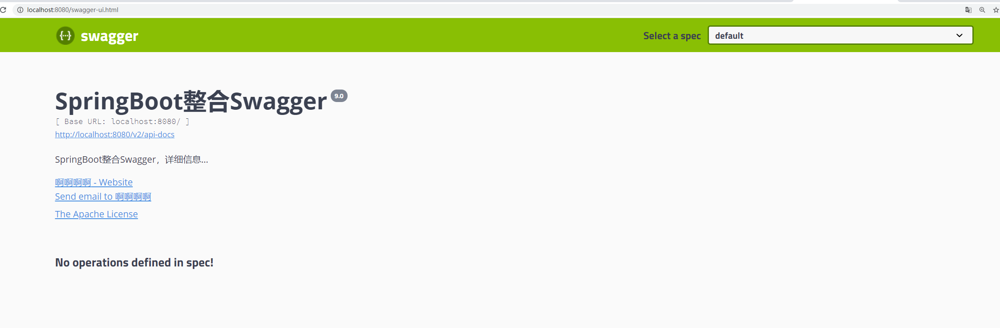
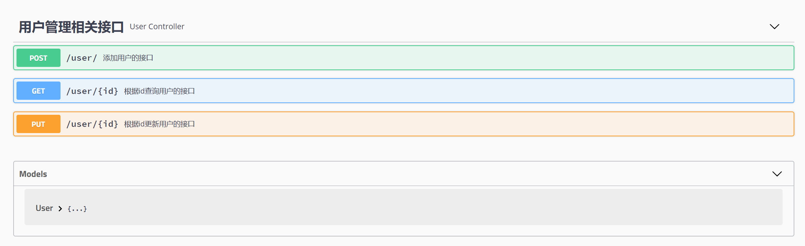

SpringBoot整合Swagger

1.添加依赖

```xml
<dependency>
    <groupId>io.springfox</groupId>
    <artifactId>springfox-swagger2</artifactId>
    <version>2.9.2</version>
</dependency>
<dependency>
    <groupId>io.springfox</groupId>
    <artifactId>springfox-swagger-ui</artifactId>
    <version>2.9.2</version>
</dependency>
```

2.配置类

```java
@Configuration
@EnableSwagger2
public class SwaggerConfig {
    @Bean
    public Docket createRestApi() {
        return new Docket(DocumentationType.SWAGGER_2)
                .pathMapping("/")
                .select()
                .apis(RequestHandlerSelectors.basePackage("com.example.swagger"))
                .paths(PathSelectors.any())
                .build().apiInfo(new ApiInfoBuilder()
                        .title("SpringBoot整合Swagger")
                        .description("SpringBoot整合Swagger，详细信息......")
                        .version("9.0")
                        .contact(new Contact("啊啊啊啊","blog.csdn.net","aaa@gmail.com"))
                        .license("The Apache License")
                        .licenseUrl("http://www.baidu.com")
                        .build());
    }
}
```

首先通过@EnableSwagger2注解启用Swagger2，然后配置一个Docket Bean，这个Bean中，**配置映射路径和要扫描的接口的位置**，在apiInfo中，主要配置一下Swagger2文档网站的信息，例如网站的title，网站的描述，联系人的信息，使用的协议等等。

此时启动项目，输入http://localhost:8080/swagger-ui.html，能够看到如下页面，说明已经配置成功了：



编写控制类

```java
@RestController
@Api(tags = "用户管理相关接口")
@RequestMapping("/user")
public class UserController {

    @PostMapping("/")
    @ApiOperation("添加用户的接口")
    @ApiImplicitParams({
            @ApiImplicitParam(name = "username", value = "用户名", defaultValue = "李四"),
            @ApiImplicitParam(name = "address", value = "用户地址", defaultValue = "深圳", required = true)
    })
    public User addUser(String username, @RequestParam(required = true) String address) {
        return new User(1,username,address);
    }

    @GetMapping("/{id}")
    @ApiOperation("根据id查询用户的接口")
    @ApiImplicitParam(name = "id", value = "用户id", defaultValue = "99", required = true)
    public User getUserById(@PathVariable Integer id) {
        User user = new User();
        user.setId(id);
        return user;
    }
    @PutMapping("/{id}")
    @ApiOperation("根据id更新用户的接口")
    public User updateUserById(@RequestBody User user) {
        return user;
    }
}
```

这里边涉及到多个API，分别说明如下：

- @Api注解可以用来标记当前Controller的功能。

- @ApiOperation注解用来标记一个方法的作用。

- @ApiImplicitParam注解用来描述一个参数，可以配置参数的中文含义，也可以给参数设置默认值，这样在接口测试的时候可以避免手动输入。

- 如果有多个参数，则需要使用多个@ApiImplicitParam注解来描述，多个@ApiImplicitParam注解需要放在一个@ApiImplicitParams注解中。

- 需要注意的是，@ApiImplicitParam注解中虽然可以指定参数是必填的，但是却不能代替@RequestParam(required = true)，前者的必填只是在Swagger2框架内必填，抛弃了Swagger2，这个限制就没用了，所以假如开发者需要指定一个参数必填，@RequestParam(required = true)注解还是不能省略。

- 如果参数是一个对象（例如上文的更新接口），对于参数的描述也可以放在实体类中。例如下面一段代码：

  ```java
  @ApiModel
  public class User {
      @ApiModelProperty(value = "用户id")
      private Integer id;
      @ApiModelProperty(value = "用户名")
      private String username;
      @ApiModelProperty(value = "用户地址")
      private String address;
  }
  ```

  接下来刷新http://localhost:8080/swagger-ui.html，就能看到如下描述信息

