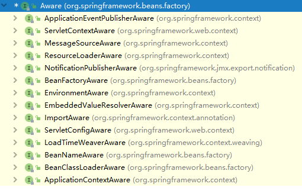

> Aware ，译为"察觉的；注意到的；感知的" ，XxxxAware 也就是对....感知的。

# 1.概述

Spring 的依赖注入最大亮点就是所有的 Bean 对 Spring 容器的存在是没有意识的，但是在实际项目中，我们不可避免的要用到 Spring 容器本身提供的资源，这时候要让 Bean 主动意识到 Spring 容器的存在，才能调用 Spring 所提供的资源，这就是 Spring Aware。

Spring Aware是个没有定义任何方法的接口，实现了该接口的bean是具有回调spring容器的能力,我们可以看到,是一个空接口,实际方法的签名是由各个子接口来实现,通常只接受返回单个参数的setter方法，如下所示，就是Aware接口与它的子接口：

```java
public interface Aware {

}
```



# 2.源码分析

接下来通过分析spring源码，我们来看看其他典型的Aware子类有哪些，使用场景是什么？

首先，我们知道在`AbstractApplicationContext`里面真正的启动`ApplicationContext`的函数是`refresh()`方法，而在该方法中有一个`prepareBeanFactory`方法，在这里，会创建一个bean后置处理器`ApplicationContextAwareProcessor`，如下所示：

```java
protected void prepareBeanFactory(ConfigurableListableBeanFactory beanFactory) {
		// Tell the internal bean factory to use the context's class loader etc.
		beanFactory.setBeanClassLoader(getClassLoader());
		beanFactory.setBeanExpressionResolver(new StandardBeanExpressionResolver(beanFactory.getBeanClassLoader()));
		beanFactory.addPropertyEditorRegistrar(new ResourceEditorRegistrar(this, getEnvironment()));

		// Configure the bean factory with context callbacks.
		beanFactory.addBeanPostProcessor(new ApplicationContextAwareProcessor(this));
   		......
	}
```

我们知道，对于后置处理器，在bean被初始化之前，所有的bean后置处理器的`postProcessBeforeInitialization`方法都会被执行。

来看下`ApplicationContextAwareProcessor`的`postProcessBeforeInitialization`方法

```java
	public Object postProcessBeforeInitialization(Object bean, String beanName) throws BeansException {
		if (!(bean instanceof EnvironmentAware || bean instanceof EmbeddedValueResolverAware ||
				bean instanceof ResourceLoaderAware || bean instanceof ApplicationEventPublisherAware ||
				bean instanceof MessageSourceAware || bean instanceof ApplicationContextAware)){
			return bean;
		}

		AccessControlContext acc = null;

		if (System.getSecurityManager() != null) {
			acc = this.applicationContext.getBeanFactory().getAccessControlContext();
		}

		if (acc != null) {
			AccessController.doPrivileged((PrivilegedAction<Object>) () -> {
				invokeAwareInterfaces(bean);
				return null;
			}, acc);
		}
		else {
			invokeAwareInterfaces(bean);
		}

		return bean;
	}
```

继续看`invokeAwareInterfaces`方法：

```java
private void invokeAwareInterfaces(Object bean) {
		if (bean instanceof EnvironmentAware) {
			((EnvironmentAware) bean).setEnvironment(this.applicationContext.getEnvironment());
		}
		if (bean instanceof EmbeddedValueResolverAware) {
			((EmbeddedValueResolverAware) bean).setEmbeddedValueResolver(this.embeddedValueResolver);
		}
		if (bean instanceof ResourceLoaderAware) {
			((ResourceLoaderAware) bean).setResourceLoader(this.applicationContext);
		}
		if (bean instanceof ApplicationEventPublisherAware) {
			((ApplicationEventPublisherAware) bean).setApplicationEventPublisher(this.applicationContext);
		}
		if (bean instanceof MessageSourceAware) {
			((MessageSourceAware) bean).setMessageSource(this.applicationContext);
		}
		if (bean instanceof ApplicationContextAware) {
			((ApplicationContextAware) bean).setApplicationContext(this.applicationContext);
		}
	}
```

从上述代码可以看出，如果当前的bean实现了某个接口，那么它的某个对应的方法就会被调用，例如我们创建了一个bean实现了`ApplicationContextAware`接口，那么这个bean的`setApplicationContext`方法就会被调用，入参是`applicationContext`成员变量，这样我们的bean就能得到`applicationContext`对象了。

但是可以看到，如上Aware中并没有`BeanNameAware`接口的调用场景，那么`BeanNameAware`在哪里呢？直接全局搜索，可以看到`AbstractAutowireCapableBeanFactory`中的`initializeBean`方法

```java
protected Object initializeBean(final String beanName, final Object bean, @Nullable RootBeanDefinition mbd) {
		if (System.getSecurityManager() != null) {
			AccessController.doPrivileged((PrivilegedAction<Object>) () -> {
				invokeAwareMethods(beanName, bean);
				return null;
			}, getAccessControlContext());
		}
		else {
			invokeAwareMethods(beanName, bean);
		}

		Object wrappedBean = bean;
		if (mbd == null || !mbd.isSynthetic()) {
			wrappedBean = applyBeanPostProcessorsBeforeInitialization(wrappedBean, beanName);
		}

		try {
			invokeInitMethods(beanName, wrappedBean, mbd);
		}
		catch (Throwable ex) {
			throw new BeanCreationException(
					(mbd != null ? mbd.getResourceDescription() : null),
					beanName, "Invocation of init method failed", ex);
		}
		if (mbd == null || !mbd.isSynthetic()) {
			wrappedBean = applyBeanPostProcessorsAfterInitialization(wrappedBean, beanName);
		}

		return wrappedBean;
	}
```

其中，`invokeAwareMethods`就是`BeanNameAware`接口被调用的地方，而`applyBeanPostProcessorsBeforeInitialization`方法就是前面我们分析的那些Aware子接口被调用的位置：

```java
	private void invokeAwareMethods(final String beanName, final Object bean) {
		if (bean instanceof Aware) {
			if (bean instanceof BeanNameAware) {
				((BeanNameAware) bean).setBeanName(beanName);
			}
			if (bean instanceof BeanClassLoaderAware) {
				ClassLoader bcl = getBeanClassLoader();
				if (bcl != null) {
					((BeanClassLoaderAware) bean).setBeanClassLoader(bcl);
				}
			}
			if (bean instanceof BeanFactoryAware) {
				((BeanFactoryAware) bean).setBeanFactory(AbstractAutowireCapableBeanFactory.this);
			}
		}
	}
```

做个小总结：业务按需要实现特定的Aware接口，spring容器会主动找到该bean，然后调用特定的方法，将特定的参数传递给bean。

# 3.实战演练

我们以`ApplicationContextAware`和 `BeanNameAware`为例，创建一个自定义的`Aware`实现类

```java
@Service
public class CustomizeAware implements ApplicationContextAware, BeanNameAware {
    private ApplicationContext applicationContext;
    private String beanName;
    @Override
    public void setApplicationContext(ApplicationContext applicationContext) throws BeansException {
        System.out.println("applicationContext is " + applicationContext);
        this.applicationContext = applicationContext;
    }

    @Override
    public void setBeanName(String beanName) {
        System.out.println("beanName is " + beanName);
        this.beanName = beanName;
    }

    public ApplicationContext getApplicationContext(){
        return this.applicationContext;
    }
    public String getBeanName() {
        return this.beanName;
    }
}
```

启动运行，在控制台可以明确看到对应的输出

```powershell
beanName is customizeAware

applicationContext is org.springframework.boot.web.servlet.context.AnnotationConfigServletWebServerApplicationContext@6e90536e

```

