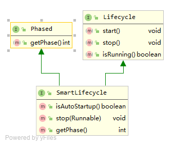

在使用Spring开发时，我们都知道，所有bean都交给Spring容器来统一管理，如果我们想在容器本身的生命周期（比如容器启动、停止）事件上做一些工作怎么办呢？Spring提供了以下接口：Lifecycle接口

# 1.SmartLifecycle接口概览

我们先来看看`SmartLifecycle`接口的类图：




如上所示，`SmartLifecycle`继承自`Lifecycle`和`Phased`两个接口，一共定义了六个方法，简要说明如下：

| **方法**        | **作用**                                                     |
| --------------- | ------------------------------------------------------------ |
| start()         | bean初始化完毕后，该方法会被执行                             |
| stop()          | 容器关闭后： spring容器发现当前对象实现了SmartLifecycle，就调用stop(Runnable)， 如果只是实现了Lifecycle，就调用stop() |
| isRunning()     | 当前状态，用来判你的断组件是否在运行。                       |
| getPhase()      | 控制多个SmartLifecycle的回调顺序的，返回值越小越靠前执行start()方法，越靠后执行stop()方法 |
| isAutoStartup() | start方法被执行前先看此方法返回值，返回false就不执行start方法了 |
| stop(Runnable)  | 容器关闭后： spring容器发现当前对象实现了SmartLifecycle，就调用stop(Runnable)， 如果只是实现了Lifecycle，就调用stop() |

可以看到，`Lifecycle`接口的方法感知容器变化，而SmartLifecycle只是Lifecycle的增强版，可以自定义优先级（`getPhase`），自主决定是否随容器启动（`isAutoStartup`），以及停止时能接受一个runnable对象（`stop(Runnable)`）。

# 2.Spring容器启动与SmartLifecycle的关系

与之前的切入点一样，我们再来看`AbstractApplicationContext`类。在`AbstractApplicationContext`类的`refresh`方法中，在bean的实例化和初始化操作完毕后，会调用finishRefresh方法：

```java
public void refresh() throws BeansException, IllegalStateException {
		synchronized (this.startupShutdownMonitor) {
            ...
			try {
                ...
				// Initialize other special beans in specific context subclasses.
				onRefresh();

				// Check for listener beans and register them.
				registerListeners();

				// Instantiate all remaining (non-lazy-init) singletons.
				finishBeanFactoryInitialization(beanFactory);

				// Last step: publish corresponding event.
				finishRefresh();
			}
            ...
		}
	}
```

finishRefresh方法内容如下，功能注释较清晰

```java

	/**
	 * Finish the refresh of this context, invoking the LifecycleProcessor's
	 * onRefresh() method and publishing the
	 * {@link org.springframework.context.event.ContextRefreshedEvent}.
	 */	
	protected void finishRefresh() {
		// Clear context-level resource caches (such as ASM metadata from scanning).
		clearResourceCaches();

		// Initialize lifecycle processor for this context.
		initLifecycleProcessor();

		// Propagate refresh to lifecycle processor first.
		getLifecycleProcessor().onRefresh();

		// Publish the final event.
		publishEvent(new ContextRefreshedEvent(this));

		// Participate in LiveBeansView MBean, if active.
		LiveBeansView.registerApplicationContext(this);
	}
```

可以看到，`initLifecycleProcessor()`和`getLifecycleProcessor().onRefresh()`这两个方法和本节的主题有关,先从从`initLifecycleProcessor`开始看起。

`initLifecycleProcessor`方法的作用是为`applicationContext`的成员变量`lifecycleProcessor`赋值，如果名称为`lifecycleProcessor`的`bean`对象，则`lifecycleProcessor`就等于这个`bean`，否则就实例化一个`DefaultLifecycleProcessor`对象，再让`lifecycleProcessor`等于这个对象，并且把这个对象作注册到spring上下文中。

```java
	public static final String LIFECYCLE_PROCESSOR_BEAN_NAME = "lifecycleProcessor";	
	
	...

/**
	 * Initialize the LifecycleProcessor.
	 * Uses DefaultLifecycleProcessor if none defined in the context.
	 * @see org.springframework.context.support.DefaultLifecycleProcessor
	 */
	protected void initLifecycleProcessor() {
		ConfigurableListableBeanFactory beanFactory = getBeanFactory();
		if (beanFactory.containsLocalBean(LIFECYCLE_PROCESSOR_BEAN_NAME)) {
			this.lifecycleProcessor =
					beanFactory.getBean(LIFECYCLE_PROCESSOR_BEAN_NAME, LifecycleProcessor.class);
			if (logger.isTraceEnabled()) {
				logger.trace("Using LifecycleProcessor [" + this.lifecycleProcessor + "]");
			}
		}
		else {
			DefaultLifecycleProcessor defaultProcessor = new DefaultLifecycleProcessor();
			defaultProcessor.setBeanFactory(beanFactory);
			this.lifecycleProcessor = defaultProcessor;
			beanFactory.registerSingleton(LIFECYCLE_PROCESSOR_BEAN_NAME, this.lifecycleProcessor);
			if (logger.isTraceEnabled()) {
				logger.trace("No '" + LIFECYCLE_PROCESSOR_BEAN_NAME + "' bean, using " +
						"[" + this.lifecycleProcessor.getClass().getSimpleName() + "]");
			}
		}
	}
```

接着看`getLifecycleProcessor().onRefresh()`的执行。根据上面的分析，如果没有自定义的`LifecycleProcessor`对象，就会创建一个`DefaultLifecycleProcessor`对象，因此执行的就是`DefaultLifecycleProcessor`的`onRefresh`方法

```java
	@Override
	public void onRefresh() {
		startBeans(true);
		this.running = true;
	}
```

```java
	private void startBeans(boolean autoStartupOnly) {
         //取得所有Lifecycle接口的实例，此map的key是实例的名称，value是实例
		Map<String, Lifecycle> lifecycleBeans = getLifecycleBeans();
		Map<Integer, LifecycleGroup> phases = new HashMap<>();
		lifecycleBeans.forEach((beanName, bean) -> {
            //autoStartupOnly等于true时，bean必须实现SmartLifecycle接口，并且isAutoStartup()返回true，才会被放入LifecycleGroup中(后续会从LifecycleGroup中取出来执行start())
			if (!autoStartupOnly || (bean instanceof SmartLifecycle && ((SmartLifecycle) bean).isAutoStartup())) {
				int phase = getPhase(bean);
				LifecycleGroup group = phases.get(phase);
				if (group == null) {
					group = new LifecycleGroup(phase, this.timeoutPerShutdownPhase, lifecycleBeans, autoStartupOnly);
                    //phases是个map，key是Lifecycle实例的phase值，value是Lifecycle实例
					phases.put(phase, group);
				}
                //当前实例加入LifecycleGroup中，该LifecycleGroup内的所有实例的phase都相等
				group.add(beanName, bean);
			}
		});
		if (!phases.isEmpty()) {
			List<Integer> keys = new ArrayList<>(phases.keySet());
            //按照所有的phase值排序，然后依次执行bean的start方法，每次都是一批phase相同的
			Collections.sort(keys);
			for (Integer key : keys) {
                //对所有Lifecycle实例逐个调用start方法
				phases.get(key).start();
			}
		}
	}
```

`SmartLifecycle`的实例的`start()`被调用的地方是在`LifecycleGroup`内部，对应的方法是`doStart()`，如下所示：

```java
	/**
	 * Start the specified bean as part of the given set of Lifecycle beans,
	 * making sure that any beans that it depends on are started first.
	 * @param lifecycleBeans a Map with bean name as key and Lifecycle instance as value
	 * @param beanName the name of the bean to start
	 */
	private void doStart(Map<String, ? extends Lifecycle> lifecycleBeans, String beanName, boolean autoStartupOnly) {
		Lifecycle bean = lifecycleBeans.remove(beanName);
		if (bean != null && bean != this) {
			String[] dependenciesForBean = getBeanFactory().getDependenciesForBean(beanName);
			for (String dependency : dependenciesForBean) {
                //如果有依赖类，迭代调用依赖类的start方法
				doStart(lifecycleBeans, dependency, autoStartupOnly);
			}
			if (!bean.isRunning() &&
					(!autoStartupOnly || !(bean instanceof SmartLifecycle) || ((SmartLifecycle) bean).isAutoStartup())) {
				if (logger.isTraceEnabled()) {
					logger.trace("Starting bean '" + beanName + "' of type [" + bean.getClass().getName() + "]");
				}
				try {
					bean.start();
				}
				catch (Throwable ex) {
					throw new ApplicationContextException("Failed to start bean '" + beanName + "'", ex);
				}
				if (logger.isDebugEnabled()) {
					logger.debug("Successfully started bean '" + beanName + "'");
				}
			}
		}
	}
```

小结如下：
1. `Lifecycle`的处理都是委托给`LifecycleProcessor`执行的，先准备好此实例；
2. 将所有的`Lifecycle`实例按照`phase`分组；
3. 从`phase`值最小的分组开始，依次执行其中每个`Lifecycle`对象的`start()`方法；

# 3.Spring容器关闭与SmartLifecycle的关系

在上述容器启动时的分析中，我们知道`Lifecycle`的处理都是委托给`LifecycleProcessor`执行的，再看一下`LifecycleProcessor`接口，除了与启动相关的`onRefresh()`方法，还有与容器关闭相关的`onClose()`方法。

```java
public interface LifecycleProcessor extends Lifecycle {

	/**
	 * Notification of context refresh, e.g. for auto-starting components.
	 */
	void onRefresh();

	/**
	 * Notification of context close phase, e.g. for auto-stopping components.
	 */
	void onClose();

}
```

去看看该方法的调用处，`LifecycleProcessor`的`onClose()`方法是在`AbstractApplicationContext`的`doClose()`方法中被调用的：

```java
protected void doClose() {
		// Check whether an actual close attempt is necessary...
		if (this.active.get() && this.closed.compareAndSet(false, true)) {
			if (logger.isDebugEnabled()) {
				logger.debug("Closing " + this);
			}
            ...
                
			// Stop all Lifecycle beans, to avoid delays during individual destruction.
			if (this.lifecycleProcessor != null) {
				try {
					this.lifecycleProcessor.onClose();
				}
				catch (Throwable ex) {
					logger.warn("Exception thrown from LifecycleProcessor on context close", ex);
				}
			}
            
            ...
		}
	}
```

继续去看`DefaultLifecycleProcessor`中是如何实现的，`DefaultLifecycleProcessor`的`onClose()`方法中先调用`stopBeans()`方法，再将成员变量`running`设置为`false`，表示状态已不是运行中：

```java
	@Override
	public void onClose() {
		stopBeans();
		this.running = false;
	}
```

`startBeans`方法和启动时执行start的逻辑基本相似，不同的是执行顺序正好相反；

```java
	private void stopBeans() {
		Map<String, Lifecycle> lifecycleBeans = getLifecycleBeans();
		Map<Integer, LifecycleGroup> phases = new HashMap<>();
		lifecycleBeans.forEach((beanName, bean) -> {
			int shutdownPhase = getPhase(bean);
			LifecycleGroup group = phases.get(shutdownPhase);
			if (group == null) {
				group = new LifecycleGroup(shutdownPhase, this.timeoutPerShutdownPhase, lifecycleBeans, false);
				phases.put(shutdownPhase, group);
			}
			group.add(beanName, bean);
		});
		if (!phases.isEmpty()) {
			List<Integer> keys = new ArrayList<>(phases.keySet());
			keys.sort(Collections.reverseOrder());
			for (Integer key : keys) {
				phases.get(key).stop();
			}
		}
	}
```

继续看`stop()`方法:

```java
		public void stop() {
			if (this.members.isEmpty()) {
				return;
			}
			if (logger.isDebugEnabled()) {
				logger.debug("Stopping beans in phase " + this.phase);
			}
			this.members.sort(Collections.reverseOrder());
             //这里有个同步逻辑，CounDownLatch中计数器的数量为当前LifecycleGroup中Lifecycle实例数量
			CountDownLatch latch = new CountDownLatch(this.smartMemberCount);
			Set<String> countDownBeanNames = Collections.synchronizedSet(new LinkedHashSet<>());
			Set<String> lifecycleBeanNames = new HashSet<>(this.lifecycleBeans.keySet());
			for (LifecycleGroupMember member : this.members) {
                //这个containsKey判断很重要，在doStop方法中，SmartLifecycle的stop方法可能会在新线程中执行，执行时如果发现了bean的依赖bean，会先去执行依赖bean的stop方法，
                //因此有可能此处的Lifecycle实例是某个实例A的依赖bean，已经在执行A实例的stop时执行过stop方法了，执行stop方法完成的时候会将自己从this.lifecycleBeans中remove掉，所以在this.lifecycleBeans就不存在了
				if (lifecycleBeanNames.contains(member.name)) {
					doStop(this.lifecycleBeans, member.name, latch, countDownBeanNames);
				}
				else if (member.bean instanceof SmartLifecycle) {
					// Already removed: must have been a dependent bean from another phase
					latch.countDown();
				}
			}
			try {
                //等到所有Lifecycle实例都执行完毕，当前线程才会执行下去
				latch.await(this.timeout, TimeUnit.MILLISECONDS);
				if (latch.getCount() > 0 && !countDownBeanNames.isEmpty() && logger.isInfoEnabled()) {
					logger.info("Failed to shut down " + countDownBeanNames.size() + " bean" +
							(countDownBeanNames.size() > 1 ? "s" : "") + " with phase value " +
							this.phase + " within timeout of " + this.timeout + ": " + countDownBeanNames);
				}
			}
			catch (InterruptedException ex) {
				Thread.currentThread().interrupt();
			}
		}
```

`PS：SmartLifecycle`实例有个`stop(Runnable)`方法，实现的时候可以在另一个线程中执行`stop()`的逻辑，这样就可以多个`SmartLifecycle`实例并行执行，可以提高执行速度，当前线程为了等待所有执行`stop()`的线程，用了`CountDownLatch`来等待，为了避免无限期等待还设置了超时时间；

最后来看看`doStop()`方法，这里面才会真正的调用到`Lifecycle`实例的`stop()`方法，还有上面我们分析的多线程逻辑：

```java
private void doStop(Map<String, ? extends Lifecycle> lifecycleBeans, final String beanName,
			final CountDownLatch latch, final Set<String> countDownBeanNames) {
		//从成员变量lifecycleBeans中remove当前bean，表示已经执行过stop方法
		Lifecycle bean = lifecycleBeans.remove(beanName);
		if (bean != null) {
             //找出依赖bean，通过迭代调用来保证依赖bean先执行stop方法
			String[] dependentBeans = getBeanFactory().getDependentBeans(beanName);
			for (String dependentBean : dependentBeans) {
				doStop(lifecycleBeans, dependentBean, latch, countDownBeanNames);
			}
			try {
				if (bean.isRunning()) {
					if (bean instanceof SmartLifecycle) {
						if (logger.isTraceEnabled()) {
							logger.trace("Asking bean '" + beanName + "' of type [" +
									bean.getClass().getName() + "] to stop");
						}
						countDownBeanNames.add(beanName);
                        //传入CountDownLatch减一的逻辑，这样SmartLifecycle的stop方法中就可以使用新线程来执行相关逻辑了
						((SmartLifecycle) bean).stop(() -> {
							latch.countDown();
							countDownBeanNames.remove(beanName);
							if (logger.isDebugEnabled()) {
								logger.debug("Bean '" + beanName + "' completed its stop procedure");
							}
						});
					}
					else {
                        //如果不是SmartLifecycle实例，就调用stop,在当前线程中执行
						if (logger.isTraceEnabled()) {
							logger.trace("Stopping bean '" + beanName + "' of type [" +
									bean.getClass().getName() + "]");
						}
						bean.stop();
						if (logger.isDebugEnabled()) {
							logger.debug("Successfully stopped bean '" + beanName + "'");
						}
					}
				}
				else if (bean instanceof SmartLifecycle) {
					// Don't wait for beans that aren't running...
                     // CountDownLatch中计数器的数量是按照SmartLifecycle实例的数量来算的，如果不在runing状态，实例的stop方法就不会调用，主线程就不用等待这次stop，latch直接减一
					latch.countDown();
				}
			}
			catch (Throwable ex) {
				if (logger.isWarnEnabled()) {
					logger.warn("Failed to stop bean '" + beanName + "'", ex);
				}
			}
		}
	}
```

从以上代码可以看出，`SmartLifecycle`实现类的`stop(Runnable)`被调用时，`LifecycleGroup`已经将`stop`调用完毕后要做的工作通过`Runnable`传递给实现类了，因此实现类中要记得执行`Runnable`的`run()`方法，否则会导致外部调用逻辑的参数不准备，影响调用线程的执行。

小结如下：
1. `AbstractApplicationContext`的`doClose()`方法在容器关闭时会被执行，此处调用`LifecycleProcessor`的`onClose()`方法，由`LifecycleProcessor`负责所有`Lifecycle`实例的关闭操作；
2. 将所有的`Lifecycle`实例按照`phase`分组；
3. 从`phase`值最大的分组开始，依次执行其中每个`Lifecycle`对象的`stop()`方法；
4. 对每个`SmartLifecycle`实例，若想并行执行以加快`stop()`执行速度，可以在`stop()`方法中用新的线程来执行`stop()`业务逻辑，但是最后不要忘记调用`Runnable`入参的`run()`方法，以完成主线程的计数和统计；
5. 主线程使用了`CountDownLatch`，在调用了`SmartLifecycle`实例的`stop()`方法后就会等待，等到计数达到`SmartLifecycle`总数或者等待超时，再继续向后执行；

# 4.Lifecycle VS SmartLifecycle

经过上面的分析，我们对`Lifecycle`和`SmartLifecycle`有了更全面的认知，如果对执行顺序没有要求，在关闭的时候也没有性能或者时间要求，那么就用`Lifecycle`吧，因为更简单，如果在乎顺序，也期望关闭时多个`Lifecycle`实例能并行执行，快速结束，`SmartLifecycle`无疑更适合。

# 5.实战SmartLifecycle接口扩展

```java
@Component
public class CustomizeLifeCycleLinstener implements SmartLifecycle {


    public boolean isRunningFlag() {
        return runningFlag;
    }

    public void setRunningFlag(boolean runningFlag) {
        this.runningFlag = runningFlag;
    }

    private boolean runningFlag = false;


    /**
     * SmartLifecycle子类的才有的方法，当isRunning方法返回true时，该方法才会被调用。
     */
    @Override
    public void stop(Runnable callback) {
        System.out.println("stop(Runnable)");
        /**
         * 如果你让isRunning返回true，需要执行stop这个方法，那么就不要忘记调用callback.run()。
         * 否则在你程序退出时，Spring的DefaultLifecycleProcessor会认为你这个TestSmartLifecycle没有stop完成，程序会一直卡着结束不了，等待一定时间（默认超时时间30秒）后才会自动结束。
         */
        callback.run();
        setRunningFlag(false);
    }

    /**
     * 1. 我们主要在该方法中启动任务或者其他异步服务，比如开启MQ接收消息<br/>
     * 2. 当上下文被刷新（所有对象已被实例化和初始化之后）时，将调用该方法，默认生命周期处理器将检查每个SmartLifecycle对象的isAutoStartup()方法返回的布尔值。
     * 如果为“true”，则该方法会被调用，而不是等待显式调用自己的start()方法。
     */
    @Override
    public void start() {
        System.out.println("start");

        // 执行完其他业务后，可以修改 isRunning = true
        setRunningFlag(true);
    }


    /**
     * 接口Lifecycle的子类的方法，只有非SmartLifecycle的子类才会执行该方法。<br/>
     * 1. 该方法只对直接实现接口Lifecycle的类才起作用，对实现SmartLifecycle接口的类无效。<br/>
     * 2. 方法stop()和方法stop(Runnable callback)的区别只在于，后者是SmartLifecycle子类的专属。
     */
    @Override
    public void stop() {
        System.out.println("stop");

        setRunningFlag(false);
    }
    /**
     * 如果工程中有多个实现接口SmartLifecycle的类，则这些类的start的执行顺序按getPhase方法返回值从小到大执行。<br/>
     * 例如：1比2先执行，-1比0先执行。 stop方法的执行顺序则相反，getPhase返回值较大类的stop方法先被调用，小的后被调用。
     */
    @Override
    public int getPhase() {
        // 默认为0
        return 0;
    }

    /**
     * 1. 只有该方法返回false时，start方法才会被执行。<br/>
     * 2. 只有该方法返回true时，stop(Runnable callback)或stop()方法才会被执行。
     */
    @Override
    public boolean isRunning() {
        // 默认返回false
        return isRunningFlag();
    }
    /**
     * 根据该方法的返回值决定是否执行start方法。<br/>
     * 返回true时start方法会被自动执行，返回false则不会。
     */
    @Override
    public boolean isAutoStartup() {
        // 默认为false
        return true;
    }
}
```

启动程序，控制台可以看到如下输出

```
2020-08-06 23:12:24.005  INFO 19200 --- [  restartedMain] o.s.s.concurrent.ThreadPoolTaskExecutor  : Initializing ExecutorService 'applicationTaskExecutor'
2020-08-06 23:12:24.145  INFO 19200 --- [  restartedMain] o.s.b.d.a.OptionalLiveReloadServer       : LiveReload server is running on port 35729
start
2020-08-06 23:12:24.180  INFO 19200 --- [  restartedMain] o.s.b.w.embedded.tomcat.TomcatWebServer  : Tomcat started on port(s): 8081 (http) with context path ''
2020-08-06 23:12:24.183  INFO 19200 --- [  restartedMain] com.wyf.spring.Application               : Started Application in 1.675 seconds (JVM running for 2.908)
Disconnected from the target VM, address: '127.0.0.1:27538', transport: 'socket'
stop(Runnable)
2020-08-06 23:12:29.172  INFO 19200 --- [extShutdownHook] o.s.s.concurrent.ThreadPoolTaskExecutor  : Shutting down ExecutorService 'applicationTaskExecutor'
```


