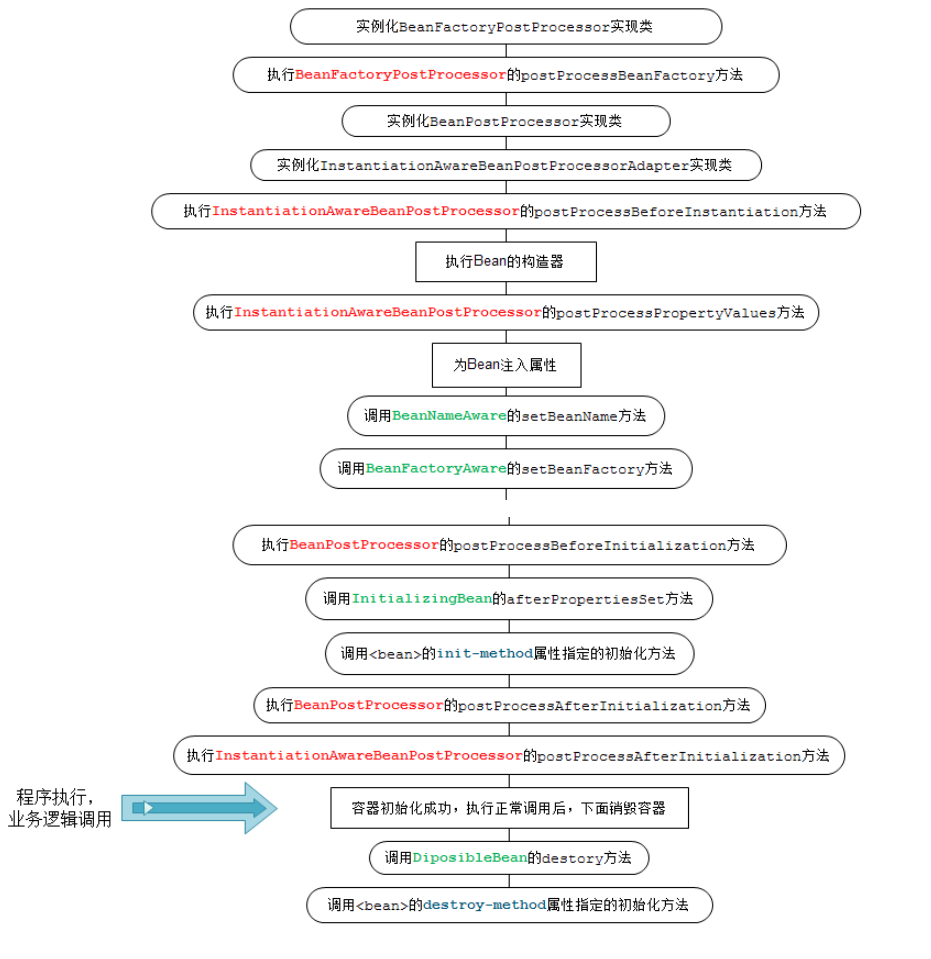

SpringBean的生命周期相信大家都比较熟悉，就算没有全面了解过，看一些高频面试题集相信都有所涉猎。如下所示：



在上一篇文章中我们提到，可以通过扩展`BeanFactoryPostProcessor`接口来对bean做自定义控制，通过该接口我们改变了bean的定义，可以想象为修改了class文件，实例化后的每个对象都改变了。我们也可以只改变具体的某个实例化的对象，这就需要通过`BeanPostProcessor`接口来实现。

# 1.源码分析

## BeanPostProcessor的实现类如何被注册到Spring容器

同样，继续回到“万物起源”——`AbstractApplicationContext`的`refresh`方法

```java
	public void refresh() throws BeansException, IllegalStateException {
		synchronized (this.startupShutdownMonitor) {
			// Prepare this context for refreshing.
			prepareRefresh();

			// Tell the subclass to refresh the internal bean factory.
			ConfigurableListableBeanFactory beanFactory = obtainFreshBeanFactory();

			// Prepare the bean factory for use in this context.
			prepareBeanFactory(beanFactory);

			try {
				// Allows post-processing of the bean factory in context subclasses.
				postProcessBeanFactory(beanFactory);

				// Invoke factory processors registered as beans in the context.
				invokeBeanFactoryPostProcessors(beanFactory);

				// Register bean processors that intercept bean creation.
				registerBeanPostProcessors(beanFactory);
                ......
```

如代码所示，`registerBeanPostProcessors`方法负责将`BeanPostProcessor`的实现类注册到容器中。继续追踪，可以看到是交给`PostProcessorRegistrationDelegate`类的方法`registerBeanPostProcessors`来实现的

```java
public static void registerBeanPostProcessors(
			ConfigurableListableBeanFactory beanFactory, AbstractApplicationContext applicationContext) {
		// 1.获取容器中已经注册的Bean的名称，根据BeanDefinition中获取BeanName
		String[] postProcessorNames = beanFactory.getBeanNamesForType(BeanPostProcessor.class, true, false);

		 // 2.通过addBeanPostProcessor方法添加的BeanPostProcessor以及注册到容器中的BeanPostProcessor的总数量
		int beanProcessorTargetCount = beanFactory.getBeanPostProcessorCount() + 1 + postProcessorNames.length;
    // 3.添加一个BeanPostProcessorChecker，主要用于日志记录
		beanFactory.addBeanPostProcessor(new BeanPostProcessorChecker(beanFactory, beanProcessorTargetCount));

		// 保存同时实现了BeanPostProcessor跟PriorityOrdered接口的后置处理器
		List<BeanPostProcessor> priorityOrderedPostProcessors = new ArrayList<>();
    	// 保存实现了MergedBeanDefinitionPostProcessor接口的后置处理器
		List<BeanPostProcessor> internalPostProcessors = new ArrayList<>();
    	// 保存同时实现了BeanPostProcessor跟Ordered接口的后置处理器的名字
		List<String> orderedPostProcessorNames = new ArrayList<>();
    	// 保存同时实现了BeanPostProcessor但没有实现任何排序接口的后置处理器的名字
		List<String> nonOrderedPostProcessorNames = new ArrayList<>();
    	// 4.遍历所有的后置处理器的名字，并根据不同类型将其放入到上面申明的不同集合中 
        // 同时会将实现了PriorityOrdered接口的后置处理器创建出来
        // 如果实现了MergedBeanDefinitionPostProcessor接口，放入到internalPostProcessors
		for (String ppName : postProcessorNames) {
			if (beanFactory.isTypeMatch(ppName, PriorityOrdered.class)) {
				BeanPostProcessor pp = beanFactory.getBean(ppName, BeanPostProcessor.class);
				priorityOrderedPostProcessors.add(pp);
				if (pp instanceof MergedBeanDefinitionPostProcessor) {
					internalPostProcessors.add(pp);
				}
			}
			else if (beanFactory.isTypeMatch(ppName, Ordered.class)) {
				orderedPostProcessorNames.add(ppName);
			}
			else {
				nonOrderedPostProcessorNames.add(ppName);
			}
		}

		// priorityOrderedPostProcessors集合排序,并将priorityOrderedPostProcessors集合中的后置处理器添加到容器中
		sortPostProcessors(priorityOrderedPostProcessors, beanFactory);
		registerBeanPostProcessors(beanFactory, priorityOrderedPostProcessors);

		// 7.遍历所有实现了Ordered接口的后置处理器的名字，并进行创建。如果实现了MergedBeanDefinitionPostProcessor接口，放入到internalPostProcessors
		List<BeanPostProcessor> orderedPostProcessors = new ArrayList<>(orderedPostProcessorNames.size());
		for (String ppName : orderedPostProcessorNames) {
			BeanPostProcessor pp = beanFactory.getBean(ppName, BeanPostProcessor.class);
			orderedPostProcessors.add(pp);
			if (pp instanceof MergedBeanDefinitionPostProcessor) {
				internalPostProcessors.add(pp);
			}
		}
   		// 排序及将其添加到容器中
		sortPostProcessors(orderedPostProcessors, beanFactory);
		registerBeanPostProcessors(beanFactory, orderedPostProcessors);

		// 7.遍历所有实现了常规后置处理器（没有实现任何排序接口）的名字，并进行创建， 如果实现了MergedBeanDefinitionPostProcessor接口，放入到internalPostProcessors 
		List<BeanPostProcessor> nonOrderedPostProcessors = new ArrayList<>(nonOrderedPostProcessorNames.size());
		for (String ppName : nonOrderedPostProcessorNames) {
			BeanPostProcessor pp = beanFactory.getBean(ppName, BeanPostProcessor.class);
			nonOrderedPostProcessors.add(pp);
			if (pp instanceof MergedBeanDefinitionPostProcessor) {
				internalPostProcessors.add(pp);
			}
		}
    	// 8.这里需要注意下，常规后置处理器不会调用sortPostProcessors进行排序
		registerBeanPostProcessors(beanFactory, nonOrderedPostProcessors);

		// 9.对internalPostProcessors进行排序并添加到容器中
		sortPostProcessors(internalPostProcessors, beanFactory);
		registerBeanPostProcessors(beanFactory, internalPostProcessors);

		// 创建一个ApplicationListenerDetector对象并且注册到容器，主要为了可以检测到所有的事件监听器，这就是前面计算beanProcessorTargetCount的值时加一的原因
		beanFactory.addBeanPostProcessor(new ApplicationListenerDetector(applicationContext));
	}
```

主要流程都已注释，就不多解读了。但需要说明一点，可以看到，在程序的末端才对`internalPostProcessors`这个队列进行排序和注入，而在此之前，`registerBeanPostProcessors`方法已经被多次调用了，难道不会发生`bean`被多次注入的情况吗？同样，要回答这个问题，我们需要再看下`registerBeanPostProcessors`方法的内部处理逻辑：

```java
	private static void registerBeanPostProcessors(
			ConfigurableListableBeanFactory beanFactory, List<BeanPostProcessor> postProcessors) {

		for (BeanPostProcessor postProcessor : postProcessors) {
			beanFactory.addBeanPostProcessor(postProcessor);
		}
	}
```

继续看`AbstractBeanFactory`的`addBeanPostProcessor`

```java
	@Override
	public void addBeanPostProcessor(BeanPostProcessor beanPostProcessor) {
		Assert.notNull(beanPostProcessor, "BeanPostProcessor must not be null");
		// Remove from old position, if any
		this.beanPostProcessors.remove(beanPostProcessor);
		// Track whether it is instantiation/destruction aware
		if (beanPostProcessor instanceof InstantiationAwareBeanPostProcessor) {
			this.hasInstantiationAwareBeanPostProcessors = true;
		}
		if (beanPostProcessor instanceof DestructionAwareBeanPostProcessor) {
			this.hasDestructionAwareBeanPostProcessors = true;
		}
		// Add to end of list
		this.beanPostProcessors.add(beanPostProcessor);
	}
```

可以看到，它是**先删除再添加**，这样反复注册也就不会发生问题了。

## 已经注册的BeanPostProcessor的实现类如何被使用

还是`AbstractApplicationContext`的`refresh`方法

```java
public void refresh() throws BeansException, IllegalStateException {
		synchronized (this.startupShutdownMonitor) {
            	......
				// Check for listener beans and register them.
				registerListeners();

				// Instantiate all remaining (non-lazy-init) singletons.
				finishBeanFactoryInitialization(beanFactory);
                ......
```

如上所示的`finishBeanFactoryInitialization`方法就是负责实例化和初始化bean的，而在这个过程中就有`BeanPostProcessor`的实现类被使用的逻辑，但鉴于中间有多层逻辑和调用，篇幅有限不多展开，直接看堆栈信息

```java
org.springframework.beans.factory.support.AbstractAutowireCapableBeanFactory.initializeBean()
org.springframework.beans.factory.support.AbstractAutowireCapableBeanFactory.doCreateBean()
org.springframework.beans.factory.support.AbstractAutowireCapableBeanFactory.createBean()
org.springframework.beans.factory.support.AbstractBeanFactory$1.getObject()
org.springframework.beans.factory.support.DefaultSingletonBeanRegistry.getSingleton()
org.springframework.beans.factory.support.AbstractBeanFactory.doGetBean()
org.springframework.beans.factory.support.AbstractBeanFactory.getBean()
org.springframework.beans.factory.support.DefaultListableBeanFactory.preInstantiateSingletons()
org.springframework.context.support.AbstractApplicationContext.finishBeanFactoryInitialization()
org.springframework.context.support.AbstractApplicationContext.refresh()
org.springframework.boot.context.embedded.EmbeddedWebApplicationContext.refresh()
org.springframework.boot.SpringApplication.refresh()
org.springframework.boot.SpringApplication.refreshContext()
org.springframework.boot.SpringApplication.run()
```

查看`AbstractAutowireCapableBeanFactory`类的`initializeBean()`方法

```java
	protected Object initializeBean(final String beanName, final Object bean, @Nullable RootBeanDefinition mbd) {
		if (System.getSecurityManager() != null) {
			AccessController.doPrivileged((PrivilegedAction<Object>) () -> {
				invokeAwareMethods(beanName, bean);
				return null;
			}, getAccessControlContext());
		}
		else {
			invokeAwareMethods(beanName, bean);
		}

		Object wrappedBean = bean;
		if (mbd == null || !mbd.isSynthetic()) {
            //对已经实例化的bean，在初始化前用BeanPostProcessor实现类去处理
			wrappedBean = applyBeanPostProcessorsBeforeInitialization(wrappedBean, beanName);
		}

		try {
             //bean的初始化
			invokeInitMethods(beanName, wrappedBean, mbd);
		}
		catch (Throwable ex) {
			throw new BeanCreationException(
					(mbd != null ? mbd.getResourceDescription() : null),
					beanName, "Invocation of init method failed", ex);
		}
		if (mbd == null || !mbd.isSynthetic()) {
            //对已经实例化的bean，在初始化后用BeanPostProcessor实现类去处理
			wrappedBean = applyBeanPostProcessorsAfterInitialization(wrappedBean, beanName);
		}

		return wrappedBean;
	}
```

很明显，`applyBeanPostProcessorsBeforeInitialization`和`applyBeanPostProcessorsAfterInitialization`方法是我们需要关注的，查看这两个方法，逻辑很简单，就是就是取出所有已注册的`BeanPostProcessor`实现类，执行其`postProcessBeforeInitialization`和`postProcessAfterInitialization`方法，入参是当前正在做实例化和初始化的bean实例

```java
	public Object applyBeanPostProcessorsBeforeInitialization(Object existingBean, String beanName)
			throws BeansException {

		Object result = existingBean;
		for (BeanPostProcessor processor : getBeanPostProcessors()) {
			Object current = processor.postProcessBeforeInitialization(result, beanName);
			if (current == null) {
				return result;
			}
			result = current;
		}
		return result;
	}

```

```java
	public Object applyBeanPostProcessorsAfterInitialization(Object existingBean, String beanName)
			throws BeansException {

		Object result = existingBean;
		for (BeanPostProcessor processor : getBeanPostProcessors()) {
			Object current = processor.postProcessAfterInitialization(result, beanName);
			if (current == null) {
				return result;
			}
			result = current;
		}
		return result;
	}
```

以上，就是Spring容器对BeanPostProcessor的实现类的调用过程。

# 2.实战演练

还是利用我们上一篇文章中创建的User类

```java
@Component
public class User {

    private String name = "AAA";

    public String getName() {
        return name;
    }

    public void setName(String name) {
        this.name = name;
    }
}
```

自定义`BeanPostProcessor`的实现类

```java
@Component
public class CustomizeBeanPostProcessor implements BeanPostProcessor {
    @Override
    public Object postProcessBeforeInitialization(Object bean, String beanName) throws BeansException {
        if("user".equals(beanName)) {
            User user = (User)bean;
            user.setName("BBB");
        }
        return bean;
    }

    @Override
    public Object postProcessAfterInitialization(Object bean, String beanName) throws BeansException {
        if("user".equals(beanName)) {
            User user = (User)bean;
            System.out.println(user.getName());
        }
        return bean;
    }
}
```

启动程序，可以看到控制台输出“BBB”，说明已经达到了控制bean实例的目标。